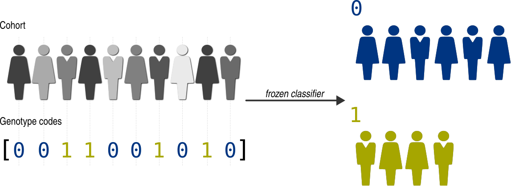

.. _genotype-codes:

======================
Group by genotype code
======================

Sometimes, we may not want to assign individuals into genotype groups using GPSEA classifiers.
Perhaps no suitable classifier exists, or the criterion cannot be encoded into a :class:`~gpsea.model.Patient`.
For instance, we might want to test for association of phenotypes with patient clusters obtained from an external clustering method.

We can easily do this with a :func:`~gpsea.analysis.clf.frozen_classifier` which groups the individuals
based on user-provided genotype codes.

*******
Example
*******

Let's assume that we want to analyze association of HPO terms
with some (arbitrary) codes in 19 individuals with mutations in *RERE* gene.

We will load the :class:`~gpsea.model.Cohort`
from a `JSON file <https://github.com/P2GX/gpsea/tree/main/docs/cohort-data/RERE.0.1.20.json>`_.
The cohort was prepared from phenopackets as described in :ref:`create-a-cohort` section,
and then serialized as a JSON file following the instructions in :ref:`cohort-persistence`.

..
   Prepare the JSON file by running the tests in `tests/tests/test_generate_doc_cohorts.py`.

>>> import json
>>> from gpsea.io import GpseaJSONDecoder
>>> fpath_cohort_json = 'docs/cohort-data/RERE.0.1.20.json'
>>> with open(fpath_cohort_json) as fh:
...     cohort = json.load(fh, cls=GpseaJSONDecoder)
>>> len(cohort)
19

Now, we prepare a sequence of 19 codes (a code for an individual).
In real life, these could be e.g. cluster ids obtained by an orthogonal method,
but here, for the sake of example, we will assign the first 10 individuals into group `0`
and the rest into the group `1`:

>>> gt_codes = 10 * [0] + 9 * [1]
>>> gt_codes
[0, 0, 0, 0, 0, 0, 0, 0, 0, 0, 1, 1, 1, 1, 1, 1, 1, 1, 1]

We prepared a list of `gt_codes`, one `int` per a cohort member. The order of the codes is *important*.
It must match the order of the cohort members.

We can (optionally) define the code labels to simplify the interpretation.
For instance, we could use e.g. ``{0: "High impact", 1: "Mild impact"}`` to assign the codes with meaningful names.
However, since here we are working only with arbitrary groups, we will just use `Group A` and `Group B`:

>>> gt_code_labels = {0: "Group A", 1: "Group B"}

Now we can create the classifier using :func:`~gpsea.analysis.clf.frozen_classifier` function:

>>> from gpsea.analysis.clf import frozen_classifier
>>> gt_clf = frozen_classifier(
...     samples=cohort,
...     codes=gt_codes,
...     labels=gt_code_labels,
... )

The classifier will assign an individual from *RERE* cohort
either into `Group A` or `Group B` based on its ``gt_codes`` entry.

>>> gt_clf.class_labels
('Group A', 'Group B')

.. note::

    Frozen classifier is usable only with the individuals of the cohort that were used to create it.
    Subjecting an individual outside of the cohort raises an error.
    This is *different* from other genotype classifiers, which can be used on *any* cohort.
